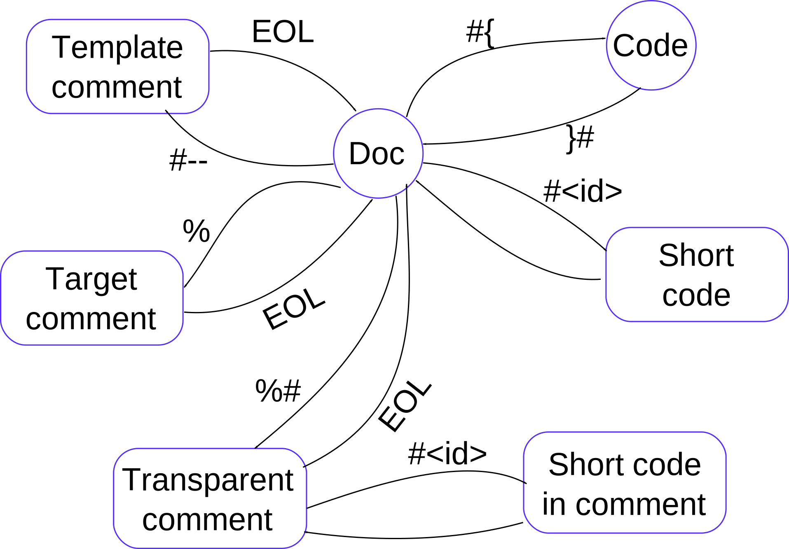

# Internal details 

## Abstract
This file is a collection of notes about the internal details of the templating engine

## State machine
This is the state diagram of the initial scanner

The front-end scanner gets in input a text and produces a sequence of tokens. Every transition not esplicitely shown in the diagram, remains in the same state 
